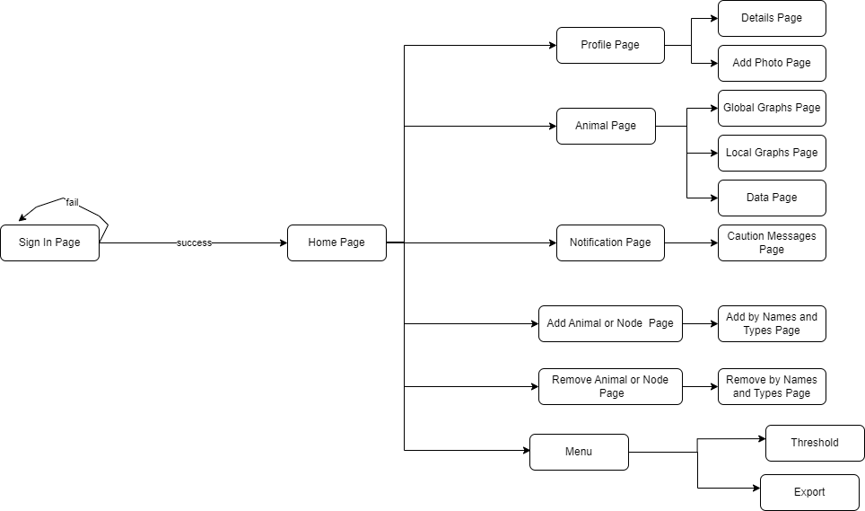
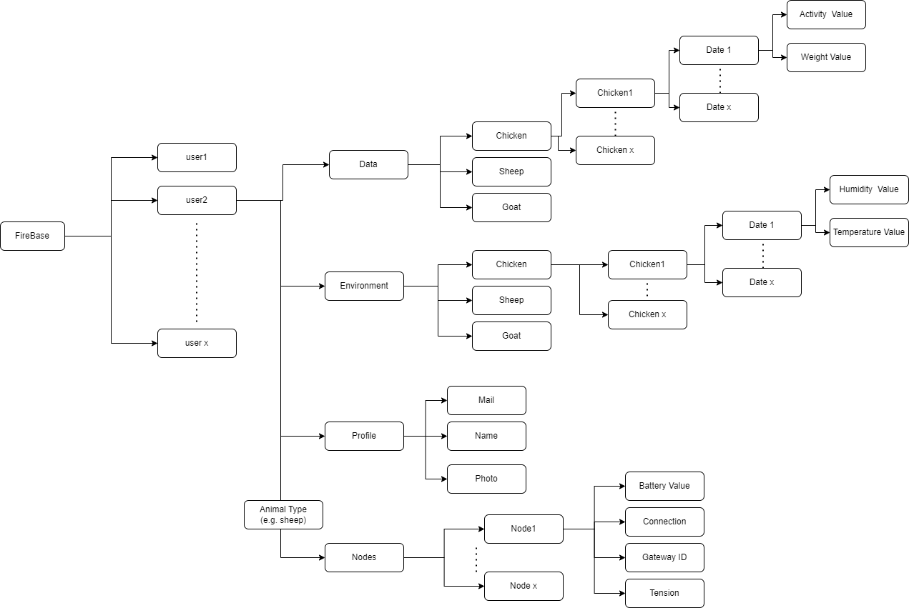

# Application's Manual

(-) If you wish to edit the android application files: First you have to install an IDE - Android 
Studio and GitHub desktop (recommended), then clone the project.
The file name indicates the content of it, please keep this convention.

(-) Android Studio (IDE):
Some of the features that facilitate the development
*  Refactoring and quick fixes.
*  Android Virtual Device (Emulator) to run and debug apps.

(-) GitHub desktop:
Connects your code to the repository and uploads your code.
Operations you can do:
* git clone, checkout, push, pull, commit, stash, ...

## Structures

We will explain structure of the application itself, and that of database.

## Application screens

The diagram below shows the exploring scenario of the app:

# Screens (partial list)

- [ ] Animal page (for each type)
- [ ] Profile Page
- [ ] Sign in Page
- [ ] Home Page
- [ ] Notifications Page
- [ ] Add Animal or Node Page
- [ ] Remove Animal or Node Page
- [ ] Set Notification Threshold Page

## Database (Firebase) structure

* users
- [ ] List of all users

* for each user:
- [ ] profile
- [ ] data
- [ ] environment
- [ ] nodes

------

* data:
- [ ] Sheep
- [ ] Goat
- [ ] Chicken

    * for each type in data:
	- [ ] List of animal ID's

	    * for each ID in type:
		-[] List of measurment dates
		      
			 * for each date in type: (represent a measurment for single animal)
	            - [ ] Activity
	            - [ ] Weight

------

* profiles:	
* for each profile:
- [ ] Name
- [ ] Mail
- [ ] Photo
- [ ] Address

------

* Environment:
- [ ] Sheep
- [ ] Goat
- [ ] Chicken

	* for each type in environment:
	- [ ] List of dates

	    * for each date in type: (represent a measurment for animal type)
	       - [ ] Humidity
	       - [ ] Temperature
	 
		   
------
	
* Animal type (Chicken/Sheep/Goat):
  * Nodes
    - [ ] List of nodes/sensors
	    * for each node in nodes:
	       - [ ] Battery
	       - [ ] Connection
	       - [ ] Gateway ID
	       - [ ] Tension
